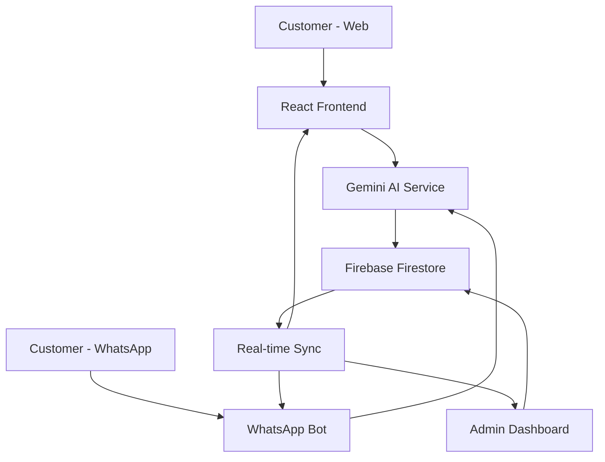

## What is Ai Studio?

Ai Studio is a comprehensive, AI-powered restaurant management platform designed specifically for modern food service businesses. Built for "Pizzería Los Genios", it combines intelligent chat assistants with powerful order and reservation management capabilities.

## Key Features

<CardGroup cols={2}>
  <Card title="AI Chat Assistants" icon="robot">
    Google Gemini-powered assistants available on both web and WhatsApp to handle customer orders and reservations conversationally.
  </Card>
  <Card title="Order Management" icon="shopping-cart">
    Complete order lifecycle management with support for pickup, delivery, and dine-in orders with real-time status tracking.
  </Card>
  <Card title="Reservation System" icon="calendar">
    Smart table reservation system with availability checking, capacity management, and automated confirmation workflows.
  </Card>
  <Card title="Firebase Backend" icon="database">
    Real-time database synchronization with Firestore ensuring data consistency across all devices and users.
  </Card>
</CardGroup>

## What Makes Ai Studio Unique?

### Conversational AI Experience

Powered by Google's Gemini 2.5 Flash model, the "Slice" assistant understands natural language and guides customers through:
- **Menu exploration** with detailed product information
- **Order placement** with pickup or delivery options
- **Table reservations** with real-time availability checking
- **Business hours queries** with schedule exception handling

### Multi-Channel Support

Reach customers wherever they are:
- **Web Interface**: Beautiful React-based customer portal
- **WhatsApp Integration**: Native WhatsApp bot for mobile-first customers
- **Admin Dashboard**: Comprehensive management interface for staff

### Real-Time Operations

All components sync in real-time:
- Order status updates appear instantly
- Table availability reflects current bookings
- Menu changes propagate to all chat assistants
- Staff notifications trigger automatically

## Architecture Overview



### Technology Stack

<CodeGroup>

```json Frontend
{
  "framework": "React 19.1.1",
  "language": "TypeScript 5.8.2",
  "build": "Vite 6.2.0",
  "styling": "Tailwind CSS 4.2.1"
}
```

```json Backend
{
  "database": "Firebase Firestore",
  "ai": "Google Gemini 2.5 Flash",
  "functions": "Netlify Functions",
  "hosting": "Netlify"
}
```

</CodeGroup>

## Core Data Models

Ai Studio manages several key entities:

### Orders
Complete order lifecycle from `PENDING` → `CONFIRMED` → `PREPARING` → `READY` → `COMPLETED`

```typescript
interface Order {
  id: string;
  customer: {
    name: string;
    phone?: string;
    address?: string;
  };
  items: OrderItem[];
  total: number;
  status: OrderStatus;
  type: 'pickup' | 'delivery' | 'dine-in';
  paymentMethod: 'Efectivo' | 'Credito' | 'Transferencia';
  createdBy: 'Admin Panel' | 'Web Assistant' | 'WhatsApp Assistant';
}
```

### Reservations
Smart table management with automated availability checking

```typescript
interface Reservation {
  id: string;
  customerName: string;
  customerPhone?: string;
  guests: number;
  reservationTime: string;
  tableIds: string[];
  status: 'Pendiente' | 'Confirmada' | 'Sentado' | 'Completada';
}
```

### Products & Menu
Dynamic menu system with categories and promotions

```typescript
interface Product {
  id: string;
  category: string;
  name: string;
  description?: string;
  price: string;
  imageUrl?: string;
}
```

## Use Cases

### For Restaurant Owners

<AccordionGroup>
  <Accordion title="Reduce Phone Call Volume">
    Let AI assistants handle routine orders and reservations, freeing staff to focus on food quality and in-person service.
  </Accordion>
  
  <Accordion title="Increase Order Accuracy">
    Structured AI conversations eliminate miscommunication. Orders are captured precisely with automatic validation.
  </Accordion>
  
  <Accordion title="24/7 Reservation System">
    Customers can book tables anytime, even when the restaurant is closed. The system enforces business rules automatically.
  </Accordion>
  
  <Accordion title="Real-Time Analytics">
    Track order volumes, popular items, peak times, and customer behavior through the admin dashboard.
  </Accordion>
</AccordionGroup>

### For Customers

- **Fast ordering** without waiting on hold
- **Natural conversation** - just chat normally
- **Immediate confirmation** with order/reservation details
- **Flexible channels** - web or WhatsApp, their choice

## Business Rules & Intelligence

The AI assistant enforces critical business logic:

<Warning>
  **Delivery Payment**: All delivery orders must use bank transfer ("Transferencia")
</Warning>

<Note>
  **Pickup Payment**: Customers choose between cash ("Efectivo") or credit ("Credito")
</Note>

<Warning>
  **Reservation Timing**: Minimum booking time is enforced (typically 60 minutes in advance)
</Warning>

<Note>
  **Capacity Management**: System prevents overbooking by tracking table capacity and current reservations
</Note>

## Getting Started

Ready to set up your own Ai Studio instance?

<Card title="Quickstart Guide" icon="rocket" href="/quickstart">
  Get from zero to a working restaurant management system in under 10 minutes
</Card>

<Card title="Installation Guide" icon="download" href="/installation">
  Detailed setup instructions for production deployment
</Card>

## Next Steps

<Steps>
  <Step title="Set up your development environment">
    Follow the [Quickstart](/quickstart) to get a local instance running
  </Step>
  <Step title="Configure Firebase">
    Set up your Firebase project and connect it to the application
  </Step>
  <Step title="Get a Gemini API key">
    Obtain your Google Gemini API key to power the AI assistant
  </Step>
  <Step title="Customize for your restaurant">
    Adapt the menu, branding, and business rules to match your needs
  </Step>
</Steps>